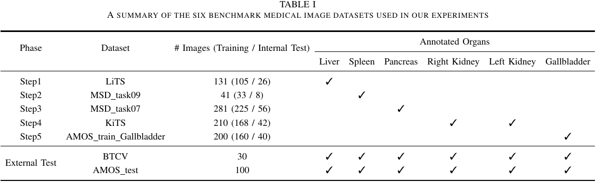
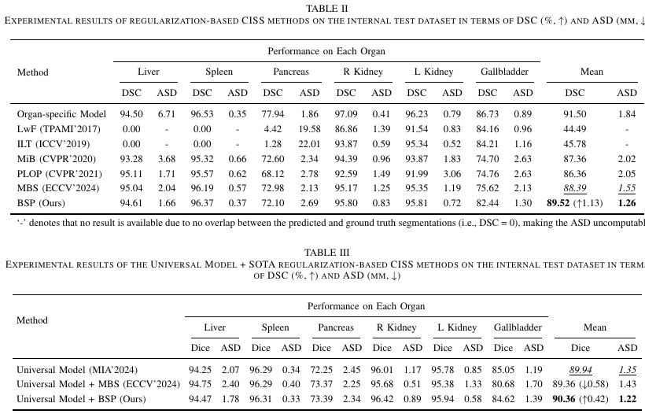
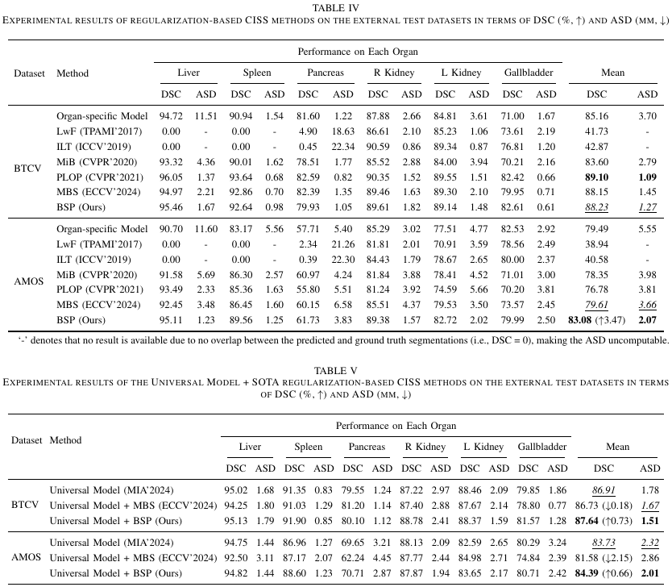
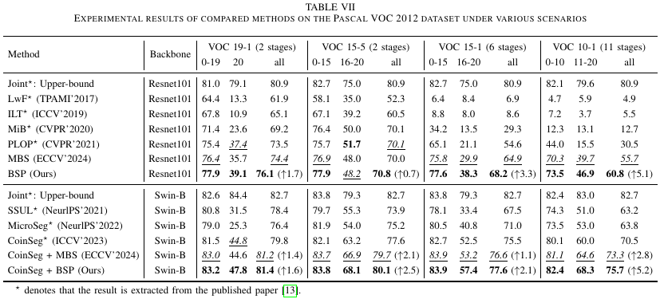

# Boosting Stability and Plasticity in Class-Incremental Semantic Segmentation
This is the implementation of BSP (Boosting Stability and Plasticity in Class-Incremental Semantic Segmentation). (This repository is building....)

Our code framework is designed following the structure of Universal Model (MIA-2024) (https://github.com/ljwztc/CLIP-Driven-Universal-Model) for medical imaging experiment and CoinSeg (ICCV-2023) (https://github.com/zkzhang98/CoinSeg) for natural imaging experiment.

## Requirements
1. CUDA 11.6
2. python(3.8.0)
3. pytorch(1.13.1+cu116)
4. torchvision(0.14.1+cu116)
5. numpy(1.24.4)
6. einops(0.8.0)
7. monai(1.1.0)
8. matplotlib

## Datasets
### Multi-Organ Segmentation

LiTS：https://competitions.codalab.org/competitions/17094

MSD_task09：http://medicaldecathlon.com/

MSD_task07：http://medicaldecathlon.com/

KiTS：https://kits19.grand-challenge.org/

AMOS：https://amos22.grand-challenge.org/

BTCV：https://www.synapse.org/Synapse:syn3193805/wiki/89480

Download Pretrained Weights
```bash
cd multi_organ_segmentation/pretrained_weights/
wget https://www.dropbox.com/s/po2zvqylwr0fuek/swin_unetr.base_5000ep_f48_lr2e-4_pretrained.pt
```

### Natural Imaging Segmentation
Download VOC 2012 by running 
```bash
bash ./natural_imaging_segmentation/datasets/data/download_voc.sh
```
Organize datasets in the following structure.
```bash
  path_to_your_dataset/ 
  ├── VOC2012/
  │ ├── Annotations/ 
  │ ├── ImageSet/ 
  │ ├── JPEGImages/ 
  │ ├── SegmentationClassAug/ 
  │ └── proposal100/  
```
You can get [proposal100](https://drive.google.com/file/d/1FxoyVa0I1IEwtW2ykGlNf-JkOYkK80E6/view) here (provided by [MicroSeg](https://github.com/zkzhang98/MicroSeg)(NeurIPS'2022)).

## Experimental results
### 1. Medical imaging experimental results on the internal test datasets

### 2. Medical imaging experimental results on the external test datasets

### 3. Natural imaging experimental results

